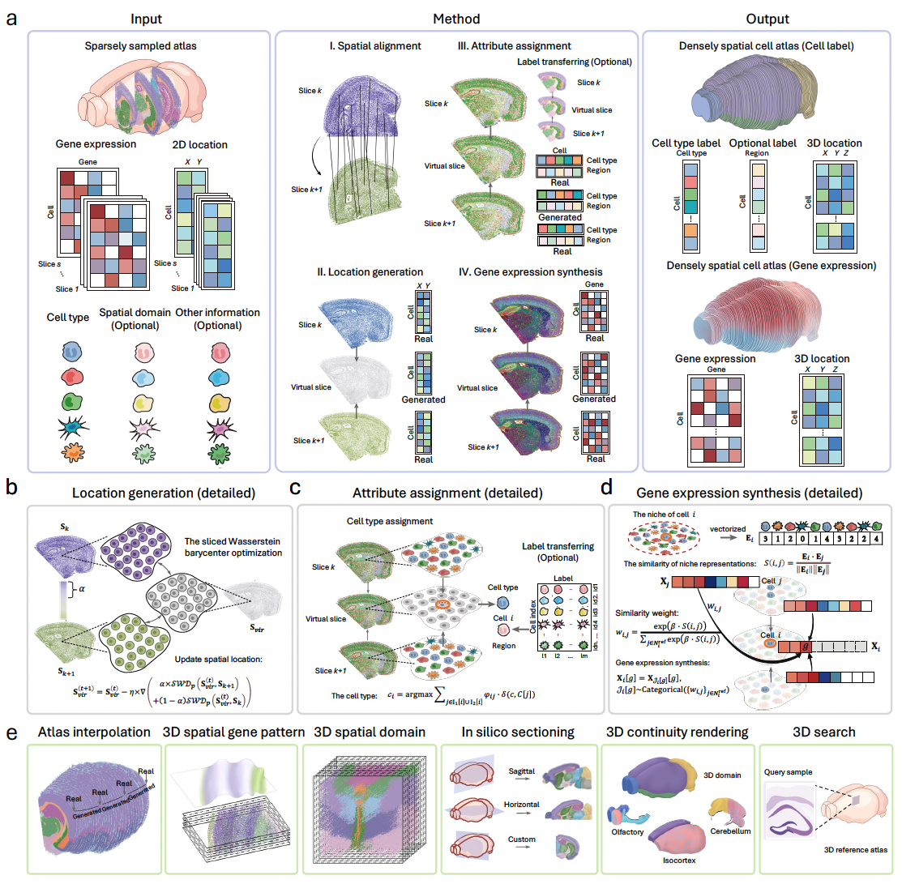

.. SpatialZ documentation master file, created by
   sphinx-quickstart on Sat Oct 25 11:27:10 2025.
   You can adapt this file completely to your liking, but it should at least
   contain the root `toctree` directive.

Bridging the Dimensional Gap from Planar Spatial Transcriptomics to 3D Cell Atlases
====================================================================================

.. toctree::
   :maxdepth: 1
   :caption: Contents:

   Overview
   Installation
   Evaluation on a real 3D spatial transcriptomics data
   Spatial dense data construction with SpatialZ

Overview
========
Spatial transcriptomics (ST) has revolutionized our understanding of tissue architecture, yet constructing comprehensive three-dimensional (3D) cell atlases remains challenging due to technical limitations and high cost. Current approaches typically capture only sparsely sampled two-dimensional sections, leaving substantial gaps that limit our understanding of continuous organ organization. Here, we present SpatialZ, a computational framework that bridges these gaps by generating virtual slices between experimentally measured sections, enabling the construction of dense 3D cell atlases from planar ST data. SpatialZ is designed to operate at single-cell resolution and function independently of gene coverage limitations inherent to specific spatial technologies. Comprehensive validation demonstrates that SpatialZ accurately preserves cell identities, gene expression patterns, and spatial relationships. Leveraging the BRAIN Initiative Cell Census Network data, we constructed a 3D hemisphere atlas comprising over 38 million cells, a scale not feasible experimentally. This dense atlas enables novel capabilities, including in silico sectioning at arbitrary angles, explorations of gene expression across both 3D volumes and surfaces, and 3D mapping of query tissue sections, and discovery of 3D spatial molecular architectures through new synthesized views. To demonstrate its extensibility beyond transcriptomics, we applied SpatialZ to imaging mass cytometry data from human breast cancer, successfully deciphering 3D spatial gradients within the tumor microenvironment. Our approach generates digital organs that provide previously unattainable 3D resolution of spatial molecular landscapes.

Citation
========
If you use SpatialZ in your research, please cite:

**Lin, S., Wang, Z., Cui, Y., Zou, Q., Han, C., Yan, R., ... & Yuan, Z. (2024). Bridging the Dimensional Gap from Planar Spatial Transcriptomics to 3D Cell Atlases. bioRxiv, 2024-12.**
